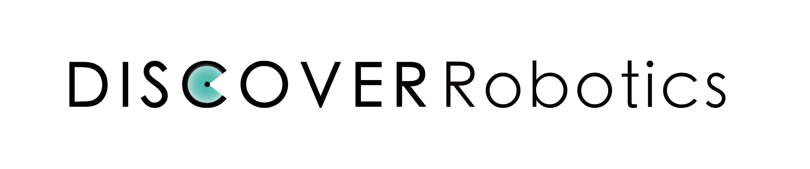

<a name="readme-top"></a>


<!-- PROJECT LOGO -->
<br />
<div align="center">
  <a href="https://git.qiuzhi.tech:20000">
    
  </a>

  <h1 align="center">AIRBOT_PLAY Control Python Interface</h3>

  <p align="center">
    适用于AIRBOT_PLAY机械臂 🦾 的Python接口（由arm-control C++ SDK经Pybind转换而来）
    <br />
    <a href="https://git.qiuzhi.tech:20000/airbot-play/control/arm-control.git"><strong>浏览C++接口 »</strong></a>
    <br />
    <br />
  </p>
</div>


<!-- TABLE OF CONTENTS -->
<details>
  <summary>目录</summary>
  <ol>
    <li>
      <a href="#✨-关于项目">关于项目</a>
      <ul>
        <li><a href="#构建基于">构建基于</a></li>
      </ul>
    </li>
    <li>
      <a href="#🚀-开始一切">开始一切</a>
      <ul>
        <li><a href="#安装依赖">安装依赖</a></li>
        <li><a href="#编译">编译</a></li>
        <li><a href="#启动">启动</a></li>
      </ul>
    </li>
    <li><a href="#📍-未来规划">未来规划</a></li>
    <li><a href="#🤝-贡献你的代码">贡献你的代码</a></li>
    <li><a href="#📞-联系我们">联系我们</a></li>
  </ol>
</details>


<!-- ABOUT THE PROJECT -->
## ✨ 关于项目

这是适配**AIRBOT_PLAY**机械臂的核心控制代码arm-control的Python版本；Discover Robotics致力于智能机器人领域技术的研发和探索，而AIRBOT_PLAY则是智能机械臂技术的一次尝试。该机械臂可装载在轮式、四足、轮腿机器人平台上，配合大型语言模型完成复杂的智能任务。本仓库中代码是最基本的底层控制代码的Python接口。

以下是现有功能：
* 在关节和任务空间中移动
* 示教和回放
* 具有关节扭矩估计的力控制
* 监测整机状态

<p align="right">（<a href="#readme-top">回到顶部</a>）</p>


### 构建基于

* [![Kdl][Kdl.lib]][Kdl-url]

<p align="right">（<a href="#readme-top">回到顶部</a>）</p>


<!-- GETTING STARTED -->
## 🚀 开始一切
_按照下面的步骤，你就可以开始使用这个工程来开发机械臂了。_

### 安装依赖
在构建此项目之前，您需要先完成arm-control C++工程的安装。该工程链接如下：
```sh
https://git.qiuzhi.tech:20000/airbot-play/control/arm-control.git
```

### 编译

1. 拉取本仓库并进入文件夹
   ```sh
   git clone https://git.qiuzhi.tech:20000/airbot-play/control/python-interface.git
   ```
2. 进入文件夹中
   ```sh
   cd python-interface
   ```
3. 通过更新子模块下载Pybind：
    ```sh
    git submodule update --init --recursive
    ```
4. 编译
   ```sh
   mkdir build && cd build
   cmake .. && make
   cd ..
   ```
5. 安装
    ```sh
    pip install -e .
    ```

### 启动
1. 连接USB2CAN并运行can驱动程序（如果不需要使用真实机械臂，请跳过此步骤）
   ```sh
   sudo ip link set up can0 type can bitrate 1000000
   ```
2. 运动控制程序示例
    ```python
    import airbot
    import time
    # 正确设置机器人urdf模型文件路径
    urdf_path = "/path/to/your/arm-control/models/airbot_play_v2_1/urdf/airbot_play_v2_1.urdf"
    # 初始化正逆运动/动力学
    fk = airbot.ChainFKSolver(urdf_path)
    ik = airbot.ChainIKSolver(urdf_path)
    id = airbot.ChainIDSolver(urdf_path)
    # 实例化控制接口
    airbot_player = airbot.createStatus(fk, ik, id, "can0")
    # 等待机器人完成初始化
    time.sleep(2)
    # 获得当前的关节位置、速度和力矩，返回值为6个元素的tuple（机器人共有6个关节）
    # 关节从机器人底座到末端对应tuple索引0-5
    cp = list(airbot_player.get_current_joint_q())
    cv = airbot_player.get_current_joint_v()
    ct = airbot_player.get_current_joint_t()
    # 控制机械臂移动到目标关节位置（6个元素的tuple/list/np.ndarray）
    cp[5] = 1.5  # 末端电机转到1.5rad绝对位置
    airbot_player.set_target_joint_q(cp)
    # 等待运动结束（目前仅支持非阻塞移动，需手动阻塞）
    time.sleep(2)
    # 进入重力补偿模式
    airbot_player.gravity_compensation()
    time.sleep(10)
    # 通过执行关节空间控制退出重力补偿模式（通常目标为当前位置）
    airbot_player.set_target_joint_q(airbot_player.get_current_joint_q())
    while True:
      time.sleep(1)
    ```
    上述示例说明了如何使用基本的Python接口，您可以根据需要选择合适的接口实现所需功能。对于更加完整的接口的使用，请参考arm-control工程，Python版的输入输出参数只是将C++的vector替换为tuple/list/np.ndarray即可。

<p align="right">（<a href="#readme-top">回到顶部</a>）</p>

<!-- MARKDOWN LINKS & IMAGES -->
[product-screenshot]: images/screenshot.png
[Kdl.lib]: https://img.shields.io/badge/armcontrol%20C++-dedede?style=for-the-badge&logo=ros&logoColor=blue
[Kdl-url]: https://git.qiuzhi.tech:20000/airbot-play/control/arm-control.git